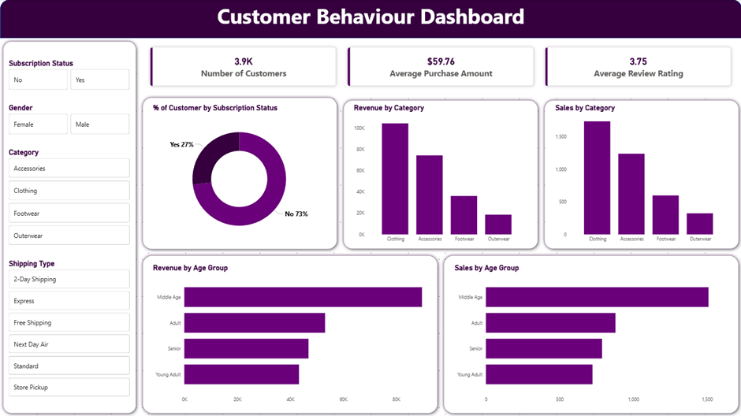

# Customer Shopping Behaviour Analysis

## Project Overview
This project analyses customer shopping behaviour using transactional data from **3,900 purchases** across various product categories. The goal is to uncover insights into **spending patterns**, **customer segments**, **product preferences**, and **subscription behaviour** to guide strategic business decisions.

---

## Dataset Summary
- **Rows:** 3,900  
- **Columns:** 18  
- **Key features:**
  - **Customer demographics:** Age, Gender, Location, Subscription Status.  
  - **Purchase details:** Item Purchased, Category, Purchase Amount, Season, Size, Colour.  
  - **Shopping behaviour:** Discount Applied, Promo Code Used, Previous Purchases, Frequency of Purchases, Review Rating, Shipping Type.
- **Missing data:** 37 values in the `review_rating` column.

---

## Tech Stack
- **Python** : Pandas for Data Cleaning / Feature Engineering as well as Data Analysis.
- **PostgreSQL** : Structured SQL Data Analysis.
- **Power BI** : Interactive Dashboard.

---

## Data Cleaning & Feature Engineering (Python)
Key preparation steps performed in Python:

1. **Load data** with pandas.  
2. **Initial exploration** using `df.info()` and basic profiling.  
3. **Whitespace cleanup** on string columns (leading/trailing/double spaces).  
4. **Duplicate check** and validation.  
5. **Missing value handling**
   - Imputed missing `review_rating` using **median rating per product category**.
6. **Column standardisation**
   - Renamed columns to **snake_case**.
7. **Feature engineering**
   - Created `age_group` by binning customer ages.  
   - Created `purchase_frequency_days` from purchase data.  
8. **Consistency check**
   - Verified redundancy between `discount_applied` and `promo_code_used`; dropped `promo_code_used`.
9. **Database integration**
   - Connected Python to PostgreSQL and loaded the cleaned dataset for SQL analysis.

---

## Analysis (Python + PostgreSQL)
The following business questions were answered using PostgreSQL and Python: 

- **Revenue by Gender** — Compare total revenue generated by male vs. female customers.  
- **High-spending Discount Users** — Identify customers who used discounts but still spent above average.  
- **Top 5 Products by Rating** — Highest average review-rated products.  
- **Shipping Type Comparison** — Compare average purchase amounts between **Standard** and **Express** shipping.  
- **Subscribers vs. Non-subscribers** — Compare average spend and total revenue by subscription status.  
- **Discount-Dependent Products** — 5 products with the highest percentage of discounted purchases.  
- **Customer Segmentation**
  - Classified customers as **New**, **Returning**, and **Loyal** based on purchase history.  
- **Top 3 Products per Category** — Most purchased products within each category.  
- **Repeat Buyers & Subscriptions** — Whether customers with **> 5 purchases** are more likely to subscribe.  
- **Revenue by Age Group** — Total revenue contribution of each age group.

---

## Dashboard (Power BI)
Built an **interactive Power BI dashboard** to present insights visually.

---

## Business Recommendations
Actionable recommendations derived from the analysis:

- **Boost subscriptions:** Promote exclusive benefits for subscribers.  
- **Customer loyalty programs:** Reward repeat buyers to move them into the “Loyal” segment. 
- **Review discount policy:** Balance sales boosts with margin control. 
- **Product positioning:** Highlight top-rated and best-selling products in campaigns.  
- **Targeted marketing:** Focus on high-revenue age groups and express-shipping users.

---
